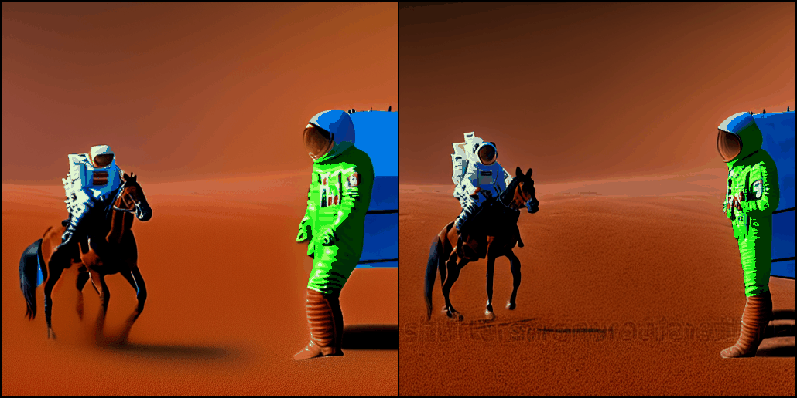

# AnimateDiff

I may stop develop this repo right now, 
AnimateDiff is not designed to do I2V mission at first, 
I spent lots of time to read diffusers source codes, 
this route maybe not the best compared to webui(ldm injection) at the end.

Though it has potential, I believe new motion model trained on bigger-datasets/specific-motion will be released soon.

## Combining

- [x] update diffusers to 0.20.1
- [x] support [IP-Adapter](https://github.com/tencent-ailab/IP-Adapter)
- [x] reconstruction codes and make animatediff a diffusers plugin like [sd-webui-animatediff](https://github.com/continue-revolution/sd-webui-animatediff)
- [x] controlnet from [TDS4874](https://github.com/TDS4874/sd-webui-controlnet/tree/animate-diff-support)
- [x] solve/locate color degrade problem, check [TDS_ solution](https://note.com/tds_/n/n5aad9ef8a9b1), It seems that any color problems came from DDIM params.
- [ ] controlnet reference mode
- [ ] controlnet multi module mode
- [ ] ddim inversion from [Tune-A-Video](https://github.com/showlab/Tune-A-Video)

Ablation experiment：

all / without denoise strength / without ipadapter / without controlnet(first frame)

<table>
    <tr>
    <td></td>
    <td></td>
    </tr>
</table>
<table>
    <tr>
    <td></td>
    <td></td>
    </tr>
</table>

Below is old results from [old codes](https://github.com/ykk648/AnimateDiff/tree/bdfd4578f4db6f148d7533f4ddb209c6b4317c39)

<table>
    <tr>
    <td></td>
    <td></td>
    </tr>
</table>
<table>
    <tr>
    <td></td>
    <td></td>
    </tr>
</table>

First image from [pikalabs](https://twitter.com/pika_labs/status/1678892871670464513), second was generated from sd1.5

First used IPAdapter+init-image-denoise, second used only IPAdapter

## ~~Training~~

- 23.8.22: 
Drop local training scripts, using authors repo to do training experiences(I2V).
First, make image injection refer [IP-Adapter](https://github.com/tencent-ailab/IP-Adapter).
Already test in [AI_power](https://github.com/ykk648/AI_power/blob/main/sd_lib/clip_encoder.py).

## My Experience

- 23.8.8: Here are some results of mine, ref [talesofai's folk](https://github.com/talesofai/AnimateDiff/blob/04b2715b39d4a02334b08cb6ee3dfe79f0a6cd7c/animatediff/pipelines/pipeline_animation.py#L288) and [diffusers](https://github.com/huggingface/diffusers/blob/main/src/diffusers/pipelines/deepfloyd_if/pipeline_if_img2img.py) to do image latent injection.

<table>
    <tr>
    <td></td>
    <td></td>
    <td></td>
    </tr>
</table>

Character Model：<a href="https://civitai.com/models/13237/genshen-impact-yoimiya">Yoimiya</a> (with an initial reference image.)

<table>
    <tr>
    <td></td>
    <td></td>
    <td></td>
    </tr>
</table>
Character Model：<a href="https://civitai.com/models/8484?modelVersionId=11523">Yae Miko</a> (with an initial reference image.)

<table>
    <tr>
    <td></td>
    <td></td>
    <td></td>
    </tr>
</table>
without Character Model, frame 20

- 23.8.9 test [sd-webui-text2video](https://github.com/kabachuha/sd-webui-text2video) noise-add policy, got bad results

## Original README

check [README.md](https://github.com/guoyww/AnimateDiff/blob/main/README.md)